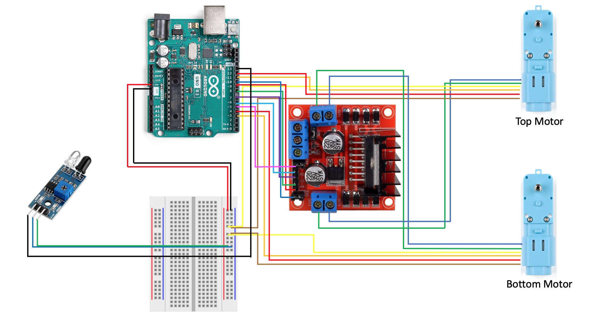

# Produce Bag Dispenser Code

This is the relevant Arduino code for our ME366J Produce Bag Dispenser. If the DIY steps are followed, once the IR sensor is triggered, an opened produce bag will be dispensed!

## Wiring Diagram

